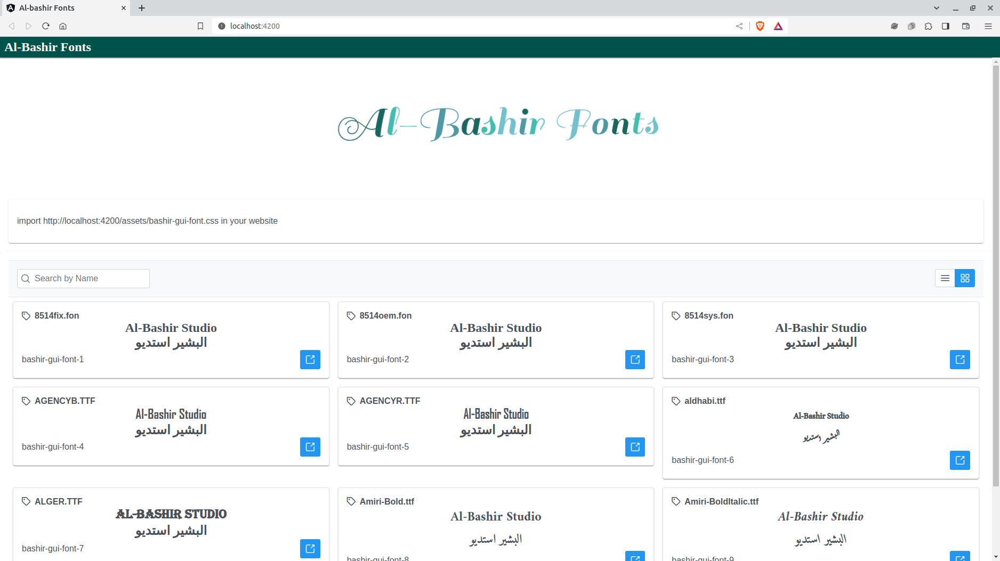

# Al-Bashir 🌴💛._チ𝓸ₙԵȿ_.💛🌴
This is a web app built using Angular For fonts.

## Start to use Fonts
- Go to https://al-bashir-fonts.vercel.app/
- import css file and (☉｡☉)!→ᴳõ🔥

## Screenshots

---


## Requirements
- Node.js v16 or higher
- Angular CLI

## Installation
-  Clone this repository:

```bash
  git clone https://github.com/mahmoudashraf-code/Al-BashirFonts.git
  cd Al-BashirWebBuilder
```
- Install dependencies:

```bash
  npm i
```


## Usage
-  Start the app:
```bash
  npm run start
```

- Open a web browser and go to http://localhost:4200


## Security
This app does not store any of your personal information. All communication between the client and server is encrypted over HTTPS.


## Troubleshooting
If you are having any problems with this app, please open an issue on GitHub.


## License
This app is licensed under the [MIT](https://choosealicense.com/licenses/mit/) License.

